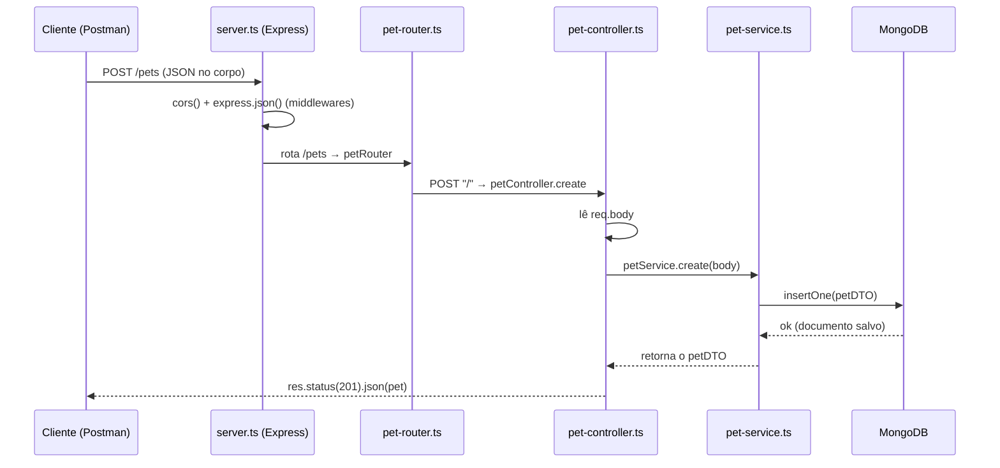

# Guia Completo do Projeto — API REST (Express + TypeScript + MongoDB)

> Este documento explica **o que cada parte faz**, **em que ordem criar** e **como uma requisição percorre o programa**.
> Use-o como roteiro para replicar a aplicação trocando a entidade `Pet` por outra qualquer (ex.: `Produto`, `Livro`, `Cliente`...).

---

## 1. Visão geral

A aplicação é uma **API REST** que faz um **CRUD** (Create, Read, Update, Delete) salvando os dados no **MongoDB**.

Ela usa o padrão de **arquitetura em camadas**. Cada camada tem **uma única responsabilidade** e só conversa com a camada vizinha:

```
Cliente (Postman / navegador / front-end)
        │  HTTP (GET, POST, PUT, DELETE)
        ▼
┌─────────────────────────────────────────────┐
│  server.ts        → liga o Express, aplica   │
│                     middlewares e rotas       │
├─────────────────────────────────────────────┤
│  router/          → diz QUAL função chamar    │
│                     para cada URL + método    │
├─────────────────────────────────────────────┤
│  controller/      → lida com req/res (HTTP)   │
│                     pega dados e devolve JSON  │
├─────────────────────────────────────────────┤
│  service/         → REGRA DE NEGÓCIO +        │
│                     acesso ao banco            │
├─────────────────────────────────────────────┤
│  db/mongo.ts      → conexão única com o Mongo  │
├─────────────────────────────────────────────┤
│  dto/             → formato (tipo) dos dados   │
└─────────────────────────────────────────────┘
        │
        ▼
   MongoDB (banco "devweb", coleção "pets")
```

**Por que separar em camadas?** Para organizar e facilitar manutenção. Se um dia mudar o banco, você mexe só no `service`. Se mudar a URL, mexe só no `router`. Cada arquivo tem um motivo claro de existir.

---

## 2. Pré-requisito: iniciar o MongoDB

Antes de rodar a aplicação, o **servidor do MongoDB precisa estar ligado**, porque a API se conecta nele em `mongodb://127.0.0.1:27017/`.

### Comando para iniciar o MongoDB

O processo do servidor do Mongo chama-se **`mongod`** (o "d" no final é de *daemon* = serviço que fica rodando em segundo plano).

**No Windows**, há duas formas comuns:

**a) Se o MongoDB foi instalado como serviço do Windows** (forma mais comum):
```powershell
net start MongoDB
```
Para parar depois: `net stop MongoDB`

**b) Iniciando o processo manualmente** (precisa de uma pasta para guardar os dados):
```powershell
mongod --dbpath "C:\data\db"
```
> Se a pasta `C:\data\db` não existir, crie antes: `mkdir C:\data\db`.
> Esse terminal fica **ocupado** mostrando os logs do Mongo — deixe-o aberto e abra outro para rodar a API.

### Como saber se já está rodando / conectar para inspecionar

O **`mongosh`** é o *shell* (terminal interativo) para conversar com o banco — útil para ver se os dados foram salvos:
```powershell
mongosh
```
Dentro dele, comandos úteis:
```javascript
show dbs            // lista os bancos
use devweb          // entra no banco que a aplicação usa
show collections    // lista as coleções (ex.: pets)
db.pets.find()      // mostra todos os documentos da coleção pets
```

> **Resumo:** `mongod` (ou `net start MongoDB`) **liga o servidor**; `mongosh` **conecta para olhar os dados**. A API só funciona com o `mongod` ligado.

---

## 3. Estrutura de pastas do projeto

```
teste-api-ts-app/
├── package.json          # dependências e scripts do projeto
├── tsconfig.json         # configurações do TypeScript
└── src/
    ├── index.ts          # ponto de entrada (inicia tudo)
    ├── server.ts         # configura o Express (rotas, middlewares)
    ├── db/
    │   └── mongo.ts       # conexão única (Singleton) com o MongoDB
    ├── dto/
    │   └── pet-dto.ts     # define o formato dos dados de Pet
    ├── router/
    │   └── pet-router.ts  # mapeia URL + método HTTP → função do controller
    ├── controller/
    │   └── pet-controller.ts  # recebe a requisição e devolve a resposta
    └── service/
        └── pet-service.ts # regra de negócio + operações no banco
```

---

## 4. Passo a passo para CRIAR a aplicação (na ordem)

> A ordem abaixo é **de baixo para cima** (do alicerce até a porta de entrada). Ela faz sentido porque cada arquivo depende do anterior. Os exemplos usam a entidade `Pet` — para outra entidade, troque o nome (ver Seção 6).

### Passo 0 — Iniciar o projeto e instalar dependências

```powershell
npm init -y                                   # cria o package.json
npm install express cors mongodb              # bibliotecas principais
npm install -D typescript @types/node @types/express @types/cors
npx tsc --init                                # cria o tsconfig.json
```

- **express** → framework web (cria o servidor e as rotas).
- **cors** → permite que um front-end em outro endereço chame a API.
- **mongodb** → driver oficial para falar com o banco MongoDB.
- **@types/...** → tipagens do TypeScript para essas bibliotecas.

---

### Passo 1 — Conexão com o banco: `src/db/mongo.ts`

É a **base**: todas as operações de banco passam por aqui. Usa o padrão **Singleton** (uma única conexão reaproveitada por toda a aplicação, em vez de abrir uma conexão nova a cada requisição).

```typescript
import { MongoClient } from "mongodb";

export default class Mongo {
    private static conn?: MongoClient;          // guarda a conexão (compartilhada)

    public static async getInstance() {
        if (!this.conn) {                        // se ainda não existe conexão...
            this.conn = new MongoClient("mongodb://127.0.0.1:27017/");
            await this.conn.connect();           // ...cria e conecta uma vez
            console.log("Conexão realizada com sucesso!");
        }
        return this.conn;                        // sempre devolve a mesma conexão
    }
}
```

**Por que Singleton?** Abrir conexão com banco é "caro". Criar uma só e reusar é mais rápido e evita estourar o limite de conexões.

---

### Passo 2 — Formato dos dados: `src/dto/pet-dto.ts`

**DTO = Data Transfer Object.** É só um **tipo** que descreve quais campos a entidade tem. Serve para o TypeScript te avisar se você esquecer/errar um campo.

```typescript
export interface PetDTO {
    name: string;
    age: number;
    race: string;
}
```

> Aqui é onde você define **os campos da SUA entidade**. Esse é o ponto que mais muda ao trocar de entidade.

---

### Passo 3 — Regra de negócio e banco: `src/service/pet-service.ts`

O **service** é o "cérebro": fala com o banco e contém as validações/regras. Cada método corresponde a uma operação do CRUD.

```typescript
import { ObjectId } from "mongodb";
import Mongo from "../db/mongo";
import { PetDTO } from "../dto/pet-dto";

class PetService {
    // READ — listar todos
    async findAll() {
        const conn = await Mongo.getInstance();
        const db = conn.db("devweb");            // nome do BANCO
        const pets = db.collection("pets");      // nome da COLEÇÃO
        return await pets.find().toArray();      // pega todos e vira array
    }

    // CREATE — inserir um novo
    async create(petDTO: PetDTO) {
        const conn = await Mongo.getInstance();
        const db = conn.db("devweb");
        const pets = db.collection("pets");
        await pets.insertOne(petDTO);
        return petDTO;
    }

    // UPDATE — atualizar pelo id
    async update(petDTO: PetDTO, id: ObjectId) {
        const conn = await Mongo.getInstance();
        const db = conn.db("devweb");
        const pets = db.collection("pets");
        const result = await pets.updateOne({ _id: id }, { $set: petDTO });

        if (result.matchedCount == 0) {          // não achou ninguém com esse id
            throw { status: 404, message: "Não existe pet com esse id." };
        }
        return petDTO;
    }

    // DELETE — remover pelo id
    async delete(id: ObjectId) {
        const conn = await Mongo.getInstance();
        const db = conn.db("devweb");
        const pets = db.collection("pets");
        const result = await pets.deleteOne({ _id: id });

        if (result.deletedCount == 0) {
            throw { status: 404, message: "Não existe pet com esse id." };
        }
    }
}

const petService = new PetService();
export { petService };
```

Conceitos importantes:
- **`db("devweb")`** → o nome do banco. **`collection("pets")`** → o nome da "tabela" (no Mongo chama-se *coleção*).
- **`ObjectId`** → o `_id` do MongoDB não é um número simples, é um tipo especial. Por isso o id da URL (texto) precisa virar `ObjectId`.
- **`throw { status, message }`** → quando algo dá errado (ex.: id não existe), "lança um erro". Ele será capturado lá no `server.ts` (o *Error Handler*).

---

### Passo 4 — Camada HTTP: `src/controller/pet-controller.ts`

O **controller** é a ponte entre o mundo HTTP (`req`/`res`) e o service. Ele **não** acessa o banco — só pega dados da requisição, chama o service e devolve a resposta com o **status HTTP** certo.

```typescript
import { Request, Response } from "express";
import { ObjectId } from "mongodb";
import { petService } from "../service/pet-service";

class PetController {
    async findAll(req: Request, res: Response) {
        res.status(200).json(await petService.findAll());        // 200 OK
    }

    async create(req: Request, res: Response) {
        res.status(201).json(await petService.create(req.body)); // 201 Created
    }

    async update(req: Request, res: Response) {
        const petDTO = req.body;                                 // dados do corpo
        const id = new ObjectId(req.params.id?.toString());      // id vem da URL
        res.status(200).json(await petService.update(petDTO, id));
    }

    async delete(req: Request, res: Response) {
        const id = new ObjectId(req.params.id?.toString());
        await petService.delete(id);
        res.status(204).send();                                  // 204 No Content
    }
}

const petController = new PetController();
export { petController };
```

De onde vêm os dados:
- **`req.body`** → o JSON enviado no corpo da requisição (usado no POST e PUT).
- **`req.params.id`** → o valor que vem na URL, ex.: `/pets/123` → `id = "123"`.

Status HTTP usados: `200` (ok), `201` (criado), `204` (sucesso sem conteúdo de volta).

---

### Passo 5 — Rotas: `src/router/pet-router.ts`

O **router** é a "tabela de endereços": liga cada **URL + método HTTP** a uma função do controller.

```typescript
import { Router } from "express";
import { petController } from "../controller/pet-controller";

const petRouter = Router();

petRouter.get("/",     petController.findAll);   // GET    /pets
petRouter.post("/",    petController.create);    // POST   /pets
petRouter.put("/:id",  petController.update);    // PUT    /pets/:id
petRouter.delete("/:id", petController.delete);  // DELETE /pets/:id

export { petRouter };
```

> `/:id` é um **parâmetro de rota**: o que vier nessa posição da URL vira `req.params.id`.
> Note que o caminho aqui é só `/` e `/:id` — o prefixo `/pets` é adicionado no `server.ts`.

---

### Passo 6 — Configuração do servidor: `src/server.ts`

O **server** monta o Express, registra os **middlewares**, conecta o router e trata erros.

```typescript
import cors from "cors";
import express, { NextFunction, Request, Response } from "express";
import Mongo from "./db/mongo";
import { petRouter } from "./router/pet-router";

const server = async () => {
    const port = process.env.NODE_WS_PORT || 3000;
    const app = express();

    app.use(cors());            // libera chamadas de outros domínios (front-end)
    app.use(express.json());    // converte o corpo JSON em objeto (req.body)

    app.use("/pets", petRouter); // tudo que começa com /pets vai pro petRouter

    // Error Handler: captura os "throw" dos services e devolve JSON com o status
    app.use((err: any, req: Request, res: Response, next: NextFunction) => {
        const status = err.status || 500;
        const message = err.message || "Server Internal Error.";
        res.status(status).json({ message });
    });

    app.listen(port, () => {
        console.log(`O servidor web foi iniciado na porta ${port}.`);
    });

    // Ao encerrar o processo (Ctrl+C), fecha a conexão com o banco
    const shutdown = async () => {
        const conn = await Mongo.getInstance();
        await conn.close();
        console.log("Conexão encerrada com sucesso!");
        process.exit(0);
    }
    process.on("SIGTERM", shutdown);
    process.on("SIGINT", shutdown);
}

export { server };
```

O que é **middleware?** É uma função que toda requisição atravessa **antes** de chegar na rota. Aqui:
- `cors()` → permite o front-end acessar.
- `express.json()` → sem isso, `req.body` viria vazio/`undefined`.
- O **Error Handler** é um middleware especial (tem 4 parâmetros, começando por `err`). É onde os `throw` dos services "caem".

---

### Passo 7 — Ponto de entrada: `src/index.ts`

Arquivo que o Node executa primeiro. Só importa e dispara o servidor.

```typescript
import { server } from "./server";

// Inicia o programa
(server)();
```

---

## 5. Fluxo de uma REQUISIÇÃO (o caminho que os dados percorrem)

Exemplo real: criar um pet com **`POST /pets`** enviando `{ "name": "Rex", "age": 3, "race": "Labrador" }`.

### Diagrama (sequência)



### Passo a passo em texto

1. **Cliente** envia `POST /pets` com o JSON no corpo.
2. **server.ts** recebe. Passa pelos middlewares: `cors()` libera a origem e `express.json()` transforma o JSON em objeto e coloca em `req.body`.
3. Como a URL começa com `/pets`, o Express entrega para o **petRouter**.
4. **petRouter** vê que é método `POST` no caminho `/` → chama `petController.create`.
5. **petController.create** pega o `req.body` e chama `petService.create(req.body)`.
6. **petService.create** pega a conexão (`Mongo.getInstance()`), escolhe o banco `devweb` e a coleção `pets`, e faz `insertOne`.
7. O **MongoDB** salva o documento e responde ok.
8. O service devolve o objeto ao controller, que responde ao cliente com **status 201** e o JSON criado.

> **Se der erro** (ex.: PUT/DELETE com id inexistente): o service faz `throw { status: 404, ... }`. Esse erro "sobe" até o **Error Handler** no `server.ts`, que devolve `{ "message": "..." }` com o status 404. Por isso não precisa de `try/catch` em todo lugar.

**A regra de ouro do fluxo:**
`router` (qual função?) → `controller` (lida com HTTP) → `service` (regra + banco) → `db` (Mongo).
E a resposta volta pelo mesmo caminho, ao contrário.

---

## 6. Como ADAPTAR para outra entidade (ex.: trocar `Pet` por `Produto`)

Suponha que a nova entidade seja **Produto** com campos `nome`, `preco`, `quantidade`. Faça:

1. **DTO** — crie `src/dto/produto-dto.ts`:
   ```typescript
   export interface ProdutoDTO {
       nome: string;
       preco: number;
       quantidade: number;
   }
   ```

2. **Service** — crie `src/service/produto-service.ts` copiando o de pet e trocando:
   - `PetDTO` → `ProdutoDTO`
   - `db.collection("pets")` → `db.collection("produtos")`  *(escolha o nome da coleção)*
   - mensagens de erro: `"Não existe produto com esse id."`

3. **Controller** — crie `src/controller/produto-controller.ts` trocando `petService` → `produtoService` e os nomes da classe/objeto.

4. **Router** — crie `src/router/produto-router.ts` apontando para o `produtoController`.

5. **server.ts** — troque a linha de rota:
   ```typescript
   app.use("/produtos", produtoRouter);
   ```

6. O **`db/mongo.ts`** e o **`index.ts`** **não mudam**.

> Dica de busca-e-substitui: na prática, troque em todos os arquivos `Pet`→`Produto`, `pet`→`produto`, `pets`→`produtos` e ajuste os campos do DTO. É 90% do trabalho.

**Checklist do que muda por entidade:**

| Arquivo            | Muda? | O que muda |
|--------------------|:-----:|------------|
| `db/mongo.ts`      | ❌    | nada (talvez o nome do banco em `db("...")` dentro do service) |
| `dto/*.ts`         | ✅    | nome da interface e **os campos** |
| `service/*.ts`     | ✅    | nome da classe, do DTO e da **coleção** |
| `controller/*.ts`  | ✅    | nome da classe e do service importado |
| `router/*.ts`      | ✅    | controller importado |
| `server.ts`        | ✅    | a linha `app.use("/rota", router)` |
| `index.ts`         | ❌    | nada |

---

## 7. Como RODAR e TESTAR a aplicação

> **Observação:** o `package.json` atual não tem scripts de execução. Adicione um dos jeitos abaixo.

### Jeito A — rodar direto o TypeScript (mais simples para estudar)
```powershell
npm install -D tsx
```
No `package.json`, dentro de `"scripts"`:
```json
"scripts": {
  "dev": "tsx watch src/index.ts",
  "start": "tsx src/index.ts"
}
```
Depois:
```powershell
npm run dev
```

### Jeito B — compilar e rodar (TypeScript → JavaScript)
```powershell
npx tsc                 # gera a pasta dist/ com .js
node dist/index.js      # roda o JavaScript gerado
```

### Testando os endpoints (Postman, Insomnia ou curl)

Com o Mongo ligado e a API em `http://localhost:3000`:

| Operação        | Método | URL                | Corpo (JSON)                                  |
|-----------------|--------|--------------------|-----------------------------------------------|
| Listar todos    | GET    | `/pets`            | —                                             |
| Criar           | POST   | `/pets`            | `{ "name": "Rex", "age": 3, "race": "SRD" }`  |
| Atualizar       | PUT    | `/pets/<id>`       | `{ "name": "Rex", "age": 4, "race": "SRD" }`  |
| Remover         | DELETE | `/pets/<id>`       | —                                             |

Exemplo com `curl` (PowerShell):
```powershell
# Criar
curl -X POST http://localhost:3000/pets -H "Content-Type: application/json" -d '{\"name\":\"Rex\",\"age\":3,\"race\":\"SRD\"}'

# Listar
curl http://localhost:3000/pets
```

> O `<id>` você pega na resposta do GET ou no `mongosh` (`db.pets.find()`). É o valor do campo `_id`.

---

## 8. Resumo rápido (para a hora da prova)

1. **Ligar o Mongo:** `net start MongoDB` (ou `mongod --dbpath C:\data\db`).
2. **Ordem de criação:** `mongo.ts` → `dto` → `service` → `controller` → `router` → `server.ts` → `index.ts`.
3. **Fluxo da requisição:** Cliente → server (middlewares) → router → controller → service → MongoDB → e volta.
4. **Responsabilidades:** router = endereço · controller = HTTP · service = regra + banco · dto = formato dos dados.
5. **Trocar de entidade:** copiar dto/service/controller/router, renomear `Pet`→nova, ajustar campos do DTO, coleção e a linha `app.use(...)` no server.
```